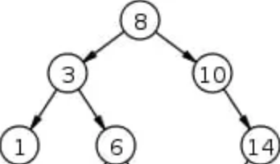

# Linked List- Find Largest Value

The algorythm will traverse the linked list while head not equal to None.  I decided to initialize Max to 0.  A condition is created to assign if max value is found. Process will end when head is not equal to None.

## Code

class Node:

    def __init__(self):
        self.value = None
        self.next = None

head = None

def largestValue(head):

    max = 0

    if head == None:
        print("No values in Linked List")
        return
 
    while (current != None):
        if (max < current.value) :
            max = current.value
        current = current.next
     
    return max

## Trace

Sample : head -> 12 -> 34 -> 56 -> none

### Pass 1

Initialize max as 0.  Max will help us compare against each node value.

### Pass 2

Check if there are any values in Linked List.  If no values are found then print ""No values in Linked List".

### Pass 3

If value is found, then start traversing through linked list.

### Pass 4

Check if head is greater than zero. As 12 is greater than 0, current node (head) of 12 becomes the new max.

### Pass 5

Traverse then to the the next node.  The next node with value of 34 is now current.

### Pass 6

Compare the current max of 12 to the new node value of 34.  Now the node with value of 34 becomes the new max.

### Pass 7

Traverse then to the the next node.  The next node with value of 56 is now the curent.

### Pass 8

Compare the current max of 34 to the current value of 56.  Now 56 becomes the new max.

### Pass 9

Traverse then to the the next node which is NONE.  

### Pass 10

As current is NONE then return max value of 56.

## Efficiency

Time: O(n)
The basic operation of this algorithm is comparison. This will happen n number of times…concluding the algorithm.
Space: O(1)
No additional space is being created. This array is being sorted in place…keeping the space at constant O(1)

# Binary Search Tree (BST)- Find Largest Value

The algorythm will need to traverse down and right to the furthest right sub-tree node.  

## Find the node with maximum value

## (rightmost sub-tree node)

    def largestValue(root):

        current = root

        #As this is a BST, we just traverse down to the rightmost node
        
        while(current.right):
            current = current.right
        return current.value

## BST Trace

Sample:

### BST Pass 1

Start with root , which is 8.

### BST Pass 2

Traverse to the right, which is 10.

### BST Pass 3

Traverse down and right to 14.

### BST Pass 4

Return current value, wich is 14.

## BST Efficiency

BST are extemely efficient when you are finding the max value.  By definition the BST will have the largest value on the fiurthset lower right node. Time: O(log(n)). No additional space is being created.
